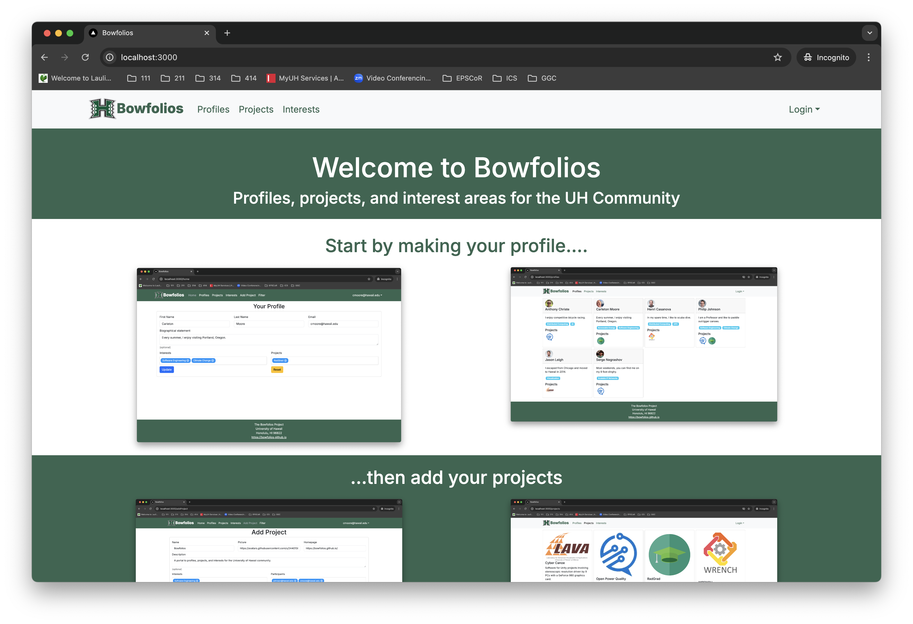
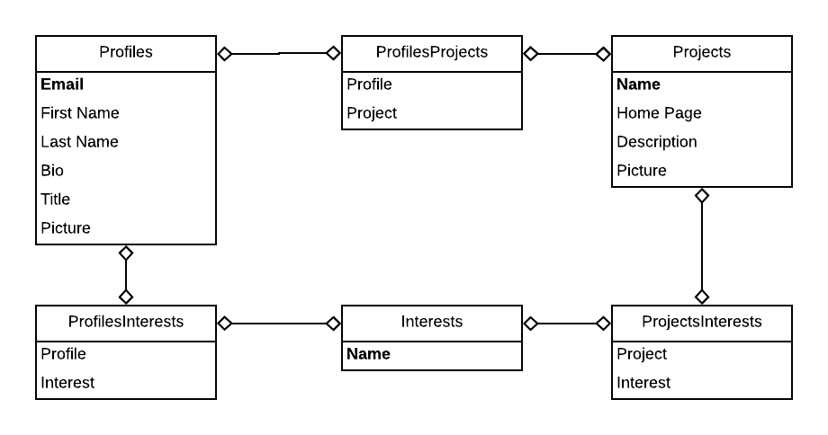

## Overview

BowFolios is an example web application that provides pages to view and (in some cases) modify profiles, projects, and interests. It illustrates various technologies useful to ICS software engineering students, including:

- [Next.js](https://nextjs.org/) for Typescript-based implementation of client and server code.

## User Guide

This section provides a walkthrough of the Bowfolios user interface and its capabilities.

## Community Feedback

Bowfolios is based upon [Next.js-application-template-react](https://ics-software-engineering.github.io/Next.js-application-template-react/) and [Next.js-example-form-react](https://ics-software-engineering.github.io/Next.js-example-form-react/). Please use the videos and documentation at those sites to better acquaint yourself with the basic application design and form processing in Bowfolios.

## Initialization

The [config](https://github.com/bowfolios/bowfolios/tree/master/config) directory is intended to hold settings files. The repository contains one file: [config/settings.development.json](https://github.com/bowfolios/bowfolios/blob/master/config/settings.development.json).

The settings.development.json file contains a field called "loadAssetsFile". It is set to false, but if you change it to true, then the data in the file app/private/data.json will also be loaded. The code to do this illustrates how to initialize a system when the initial data exceeds the size limitations for the settings file.

### Quality Assurance

#### ESLint

BowFolios includes a [.eslintrc](https://github.com/bowfolios/bowfolios/blob/master/app/.eslintrc) file to define the coding style adhered to in this application. You can invoke ESLint from the command line as follows:

ESLint should run without generating any errors.

It's significantly easier to do development with ESLint integrated directly into your IDE (such as IntelliJ).

All the tests pass, but the first test is marked as "unstable". At the time of writing, TestCafe fails the first time it tries to run a test in this mode, but subsequent attempts run normally. To prevent the test run from failing due to this problem with TestCafe, we enable [testcafe quarantine mode](https://devexpress.github.io/testcafe/documentation/guides/basic-guides/run-tests.html#quarantine-mode).

## From mockup to production

Bowfolios is meant to illustrate the use of Next.js for developing an initial proof-of-concept prototype. For a production application, several additional security-related changes must be implemented:

- Use of email-based password specification for users, and/or use of an alternative authentication mechanism.
- Use of https so that passwords are sent in encrypted format.
- Removal of the insecure package, and the addition of Next.js Methods to replace client-side DB updates.

(Note that these changes do not need to be implemented for ICS 314, although they are relatively straightforward to accomplish.)

<!-- ## Walkthrough videos

BowFolios is intended as a model of how an ICS 314 project could be organized and executed. Here are videos that walk you through various aspects of the system:

* [BowFolios Part 1: Application Overview (5 min)](https://www.youtube.com/watch?v=gr55MMWD8ok)
* [BowFolios Part 2: Application Structure and Control Flow (14 min)](https://www.youtube.com/watch?v=LYh06HSYv54)
* [BowFolios Part 3: Data Model, Data Initialization, Publications and Subscriptions (22 min)](https://www.youtube.com/watch?v=2F2Cw5Ipubc)
* [BowFolios Part 4: Forms and Next.js Methods (20 min)](https://www.youtube.com/watch?v=5qim9mXpbTM)
* [BowFolios Part 5: Loading data using Assets (8 min)](https://www.youtube.com/watch?v=NzrTzBPCJPo)
* [BowFolios Part 6: Design Patterns in BowFolios (22 min)](https://www.youtube.com/watch?v=yP-t44HBCPQ)
* [BowFolios Part 7: End-to-End testing in BowFolios (24 min)](https://www.youtube.com/watch?v=B8TSiCLBeaA)
-->

## Class Policies

* Missed homework? 
    * It’s your grade, not mine. 
    * Exceptions can be made in extenuating circumstances but will require documented evidence (doctor’s note, obituary, etc.)
* Labs can be made up afterschool or at lunchtimes
    * Please schedule with me and have your parents sign a form to approve extending or compensating for your learning time.
* Disrupting class? 
    * If you know so much that you don’t need to pay attention, come up to the front and teach it yourself!
    * (In cases where this goes surprisingly well, I can coach the student through and then have the class applaud them at the end of the lesson.)
* Trying to use your device outside of permitted time (or visiting unrelated sites/activities during classtime)? 
    * You’ll have to leave it at the hub and come back for it at the end of the day. 
    * Have fun explaining to your other teachers why you’re unprepared for their classes.
* If you’re called upon to "teach" due to disruptions more than 2x per week, you’ll have to make up the material you missed during morning breaks for the rest of the week.
* Incentive: students with the top grades in my class will get opportunities to have their projects showcased in relevant places or honored by the school
    * (ie. science fair, possibly district level, local robotics tournaments, etc.)

## Upcoming Field Trip
Please see [here](/extras/mock-trip.pdf) for the permission form.

### Credits

BowFolios template is designed, implemented, and maintained by [Philip Johnson](https://philipmjohnson.org) and [Cam Moore](https://cammoore.github.io/).
